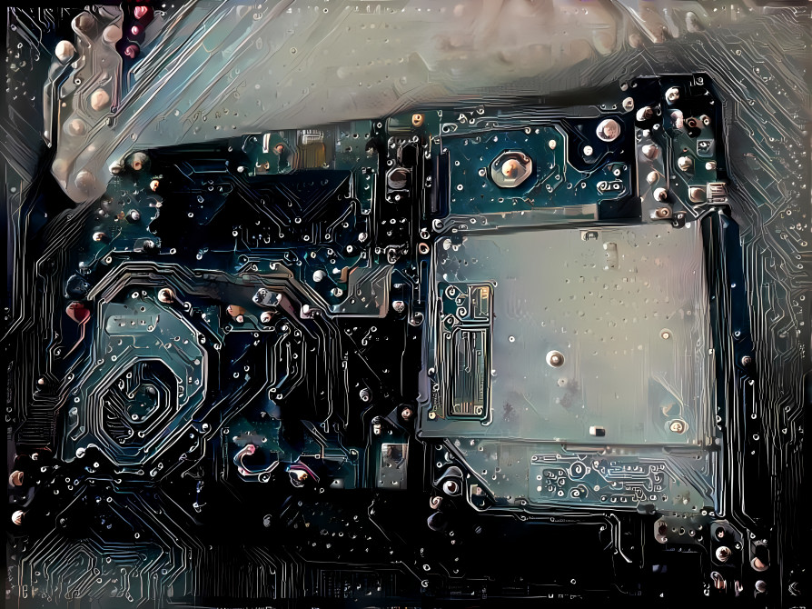

# Hardware Performance Archive
This repository contains data that are recorded hardware performance. The raw data is saved in CSV file format and is located in the dataset directory.

The release of the dataset Version 1.0.1 can be found and downloaded at [Kaggle](https://www.kaggle.com/datasets/kentvejrupmadsen/dataset-performance). You're welcome to experiement with it with 'notebooks'.

## Content
* Documents
    * [Code](code/readme.md)

    * [Dataset](dataset/readme.md)
        * Contains raw data recorded with [OpenHardwareMonitor](https://openhardwaremonitor.org/downloads/)

    * [Documentation](docs/readme.md)

    * [Formats](formats/readme.md)
        * data from dataset that has been converted into another format

    * [Scripts](scripts/readme.md)
        * Scripts to interact with the data

* Appendicies
    * [Changes](CHANGELOG.md)
    * [Source Code License - MIT License](sourcecode_license.md)
    * [Dataset License - Attribution 4.0 International](sourcecode_license.md)

## Overview
* Size of stats directory: 5.68 GB

## Download
* Download [as tar.gz](https://1drv.ms/u/s!AnVSo6qhoQp5j44rG0V-dvyoxs3r_w)
or [as zip](https://1drv.ms/u/s!AnVSo6qhoQp5j49a5woqf6x41OHMYg?e=SgTFxC)

* [Kaggle](https://www.kaggle.com/datasets/kentvejrupmadsen/dataset-performance)

## Tools
* Files logged with [OpenHardwareMonitor](https://openhardwaremonitor.org/downloads/),
[on github](https://github.com/openhardwaremonitor/openhardwaremonitor)

## Support
Currently this repository only has support for CSV files. I am currently working on a solution. To have the files reformatted into. i am looking into it.
* Formats
    * JSON
    * XML
    * TSV

* Code
    * MySQL
    * PostgreSQL

Currently also working on having the data sorted & filtered by Year. together with making branches for it.

## Cover

## Foot Notes
* Author: [Kent vejrup Madsen](https://github.com/kentVejrupMadsen/)
* Copyright 2022 Kent vejrup Madsen
* License: [MIT License](license.md)
* Changelog: [Changes](CHANGELOG.md)
* Contact: Kent.vejrup.madsen@designermadsen.com

### Document
* Created at: 29-01-2020
* Updated at: 12-07-2022
